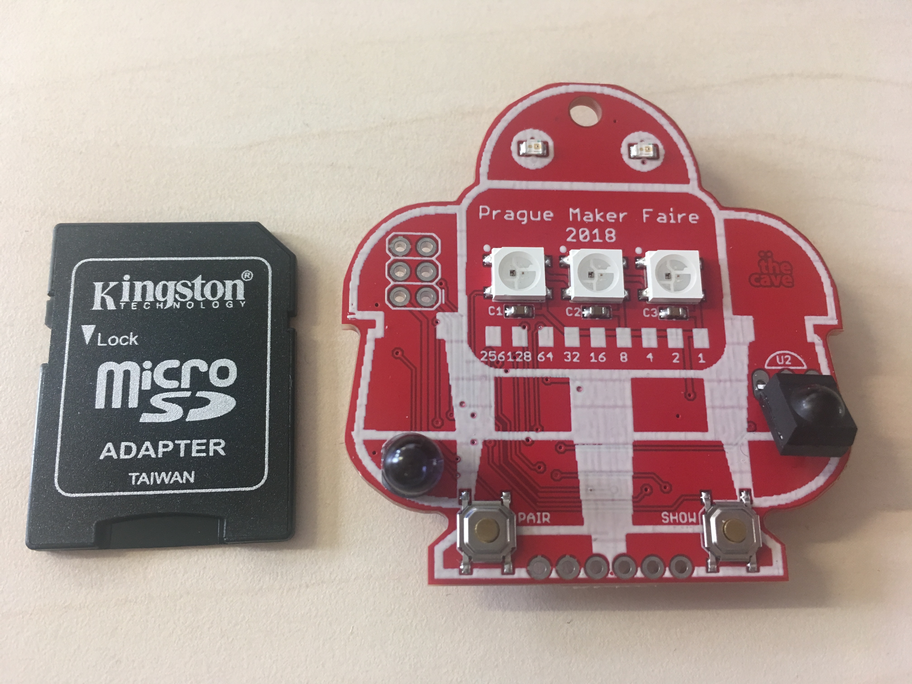

# makerfaire-prague-badge

V tomto repozitáři najdete všechy zdrojové kódy k hardwarovému badge z MakerFaire Prague 2018.

Repozitář má několik částí:

* [Arduino IDE projekt](badge)
* [Schéma pro EAGLE](eagle)
* [Hromadný upload firmware přes USBasp](upload)
* [Programování krok za krokem](programming) - podrobná příručka, jak badge přeprogramovat pomocí Arduino IDE

*Jsme hodně zvědaví, co se vám všechno s badgem podaří vymyslet. Nenechávejte si vaše prográmky jenom pro sebe, klidně je pošlete na info@thecave.cz, rádi je tu zveřejníme!*

## Jak badge vypadá

