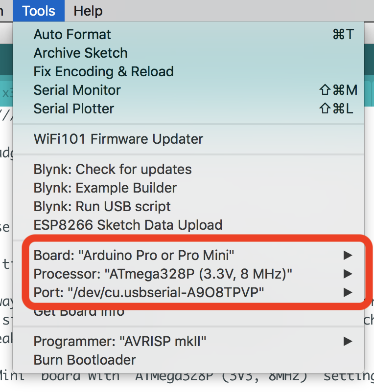
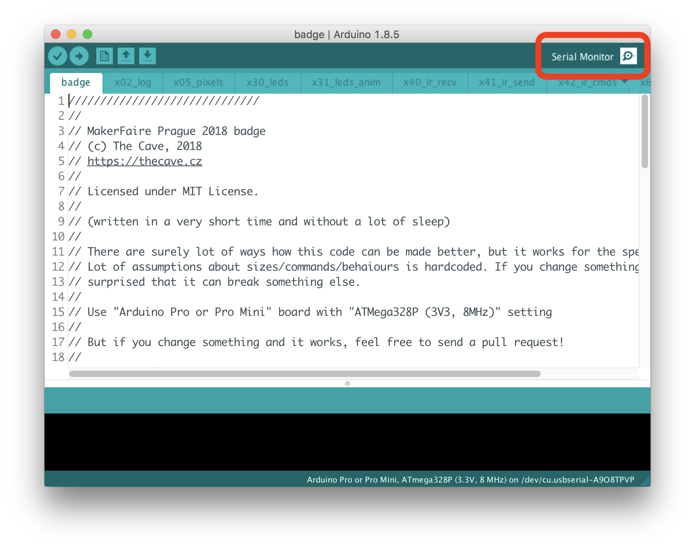
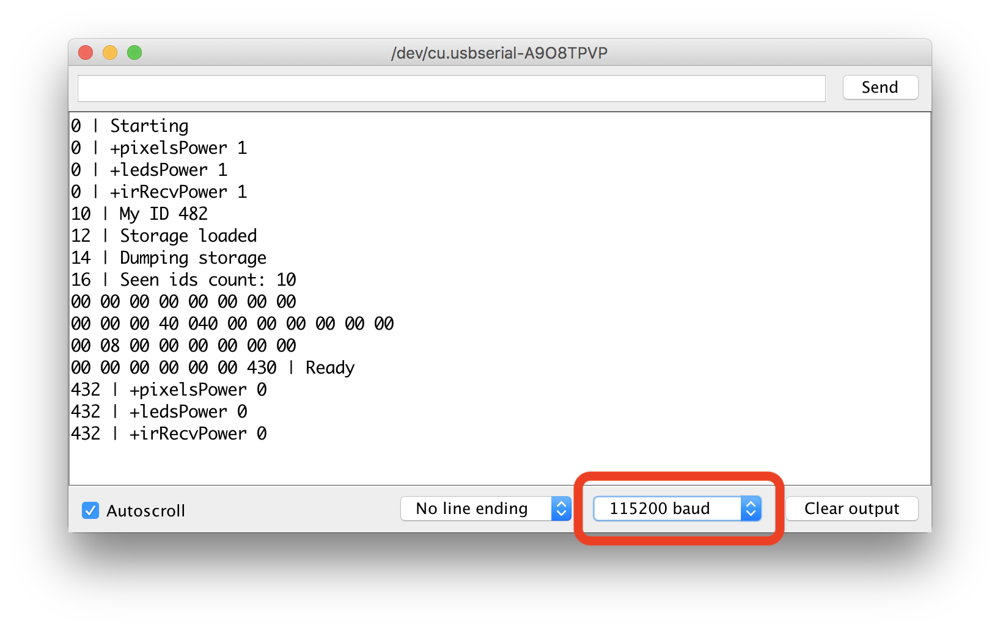
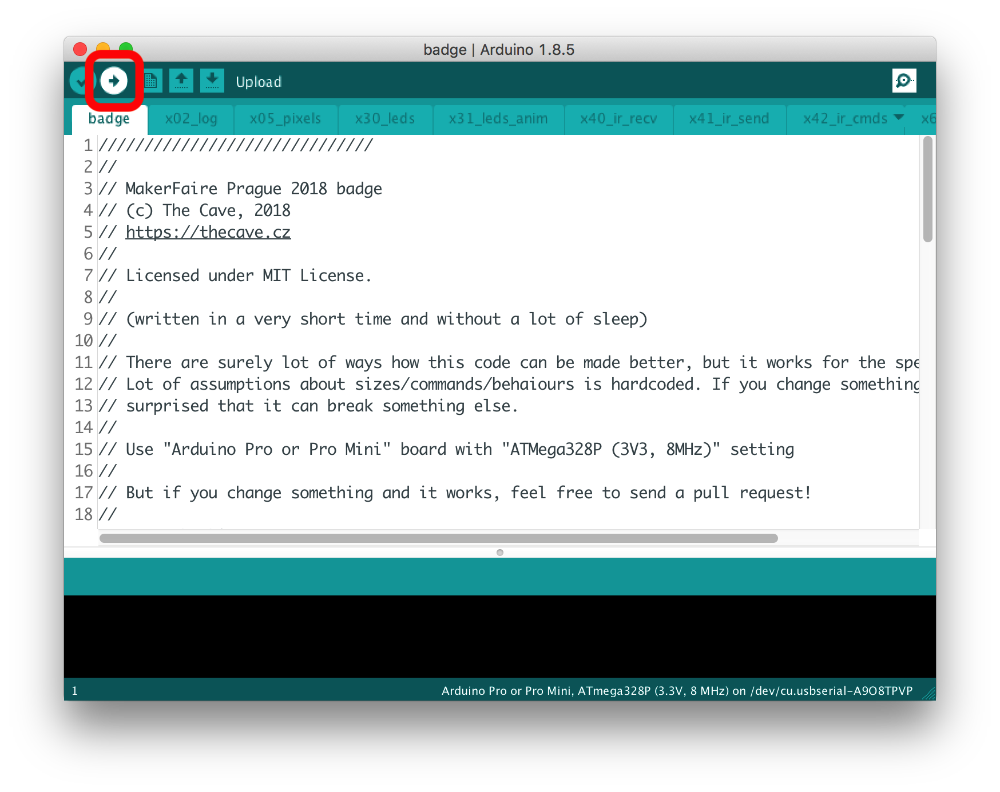

# Programování krok za krokem

## Potřebný hardware

Badge je možné programovat přes konektor pro sériovou linku nebo ISP konektor. Každý způsob vyžaduje jiný hardware, jednodušší varianta je programování přes sériovou linku. U té můžete zároveň kontrolovat, co badge přesně dělá, takže budu popisovat jenom tu.

### Sériová linka

Budete potřebovat převodník USB-Serial, propojovací vodiče a USB kabel. Vše se dá pořídit v [GM electro](https://gme.cz) popř. objednat na [Arduino-Shop.cz](https://arduino-shop.cz). Pozor, *převodník musí mít vyvedený pin `DTR`/`RESET`*, bez něj bude programování velmi komplikované.

Nákupní seznam: 

* [Převodník USB-UART, RESET pin](https://www.gme.cz/prevodnik-usb-uart-reset-pin-product-38325) nebo [FTDI převodník s mini USB](https://www.gme.cz/ftdi-prevodnik-s-mini-usb-a-spi)
* [Propojovací vodiče](https://www.gme.cz/propojovaci-vodice-zasuvka-zasuvka-40-kusu) pokud je nemáte k převodníku
* [Oboustranný kolík 2.54mm](https://www.gme.cz/oboustranny-kolik-zl201-06g) abyste mohli propojit badge s vodiči

Badge má ze spodní strany u propojovacího konektoru názvy pinů. Propojte piny se stejnými nebo podobnými názvy.

| Badge | Převodník |
| --- | --- |
| `DTR` | `DTR` |
| `TXD` | `TX` nebo `TXD` |
| `RXI` | `RX` nebo `RXI` nebo `RXD` |
| `VCC` | `VCC` nebo `3V3` |
| `CTS` | `CTS` popř. nemusí být připojeno |
| `GND` | `GND` |

## Příprava software

* Nainstalovat ovladače pro USB-Serial převodník
* Stáhnout a nainstalovat Arduino IDE (https://www.arduino.cc/en/Main/Software)
* Stáhnout a rozbalit zdrojové kódy badge (https://github.com/TheCaveCz/makerfaire-prague-badge/archive/master.zip)
* V Arduino IDE nainstalovat knihovnu `TaskScheduler`
  * V hlavním menu `Sketch` > `Include Library` > `Manage Libraries`
  * Do políčka filter your search napsat `TaskScheduler`
  * Klepnout na tlačítko `Install`

## Kontrola funkčnosti

* Spusťte Arduino IDE otevřete stažený kód badge (soubor `badge/badge.ino`)
* V menu `Tools` nastavte
  * board na `Arduino Pro or Pro mini`
  * processor na `ATMega328P (3.3V, 8MHz)`
  * port na sériový port vašeho převodníku
* Klepněte na tlačítko Serial Monitor (vpravo nahoře)
* V Serial monitoru nastavte baud rate na `115200 baud`
* Měli byste vidět výpis z badge. Pokud se tak nestane, zkontrolujte, že jste správně vybrali port popř. zkuste prohodit `TXD` a `RXI` signály (některé převodníky je mají zapojené obráceně)

## Programování

Pokud všechno proběhlo v pořádku, můžete začít programovat. Doporučuji vyjít z existujícího kódu a před změnami pořádně prostudovat, co jak funguje. Nový program pošlete do badge stisknutím tlačítka Upload (kulaté tlačítko, druhé vlevo nahoře). Arduino bude chvíli pracovat, pak vám oznámí Done uploading a tím máte hotovo.

## Závěrem

Jsme hodně zvědaví, co se vám všechno s badgem podaří vymyslet. Nenechávejte si vaše prográmky jenom pro sebe, klidně je pošlete na info@thecave.cz, rádi je tu zveřejníme! Pokud by vám cokoliv nefungovalo, nebo si nechcete kupovat potřebnou výbavu, zastavte se za námi v [The Cave](https://thecave.cz/navsteva/) a rádi vám pomůžeme!

